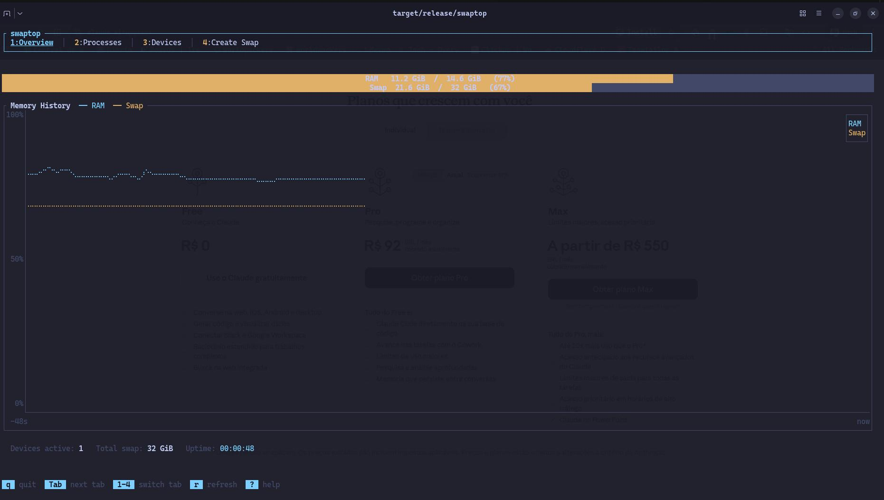

# swaptop

> A terminal-based swap and memory manager for Linux, inspired by `htop` and `btop`.

`swaptop` is an interactive TUI that lets you monitor and manage swap memory in
real time. Built as a standalone binary with no external runtime, it focuses
exclusively on swap and memory, including live metrics, per-process swap usage,
device control, and swap file creation.

---

## Screenshot



*Overview tab — RAM and swap gauges (color-coded by usage), 120-second rolling
history chart with braille-resolution lines, device summary and uptime footer,
and the keybinding status bar at the bottom.*

---

## Features

| Status | Feature |
|--------|---------|
| ✅ | Real-time RAM and swap gauges with usage color coding |
| ✅ | 120-second rolling history chart (RAM + Swap overlaid) |
| ✅ | Active swap device summary |
| ✅ | Tab navigation (Overview → Processes → Devices → Create Swap) |
| ✅ | Platform abstraction — architecture ready for macOS, BSD, Windows |
| ✅ | Per-process swap table with sorting and filtering (`/proc/PID/smaps`) |
| ✅ | Process table columns: PID, Name, User, RSS, Swap, CPU% |
| ✅ | Sort cycling across all columns with direction toggle (▾ / ▲) |
| ✅ | Live process filter with inline text input |
| ✅ | `swapon` / `swapoff` device management (requires root) |
| ✅ | Confirmation modal for destructive device operations |
| 🔜 | Process detail view with history chart and kill action |
| ✅ | Create swap file wizard (`fallocate → chmod → mkswap → swapon`) |

---

## Requirements

- **Linux** (primary target — all features available)
- Rust toolchain ≥ 1.85 (edition 2024)
- Root privileges for swap control operations (`swapon`, `swapoff`, create swap)

> macOS is partially supported (global swap totals + swap file list via glob).
> `swapon`/`swapoff`/per-process swap are unavailable on macOS due to OS restrictions.

---

## Installation

### Build from source

```bash
git clone https://github.com/youruser/swaptop
cd swaptop
cargo build --release
```

The binary will be at `target/release/swaptop`.

### Run directly

```bash
cargo run --release
```

---

## Usage

```bash
# Run as a regular user (monitoring only)
./swaptop

# Run as root to unlock device control
sudo ./swaptop
```

### Keybindings

#### Global

| Key | Action |
|-----|--------|
| `1` | Go to Overview tab |
| `2` | Go to Processes tab |
| `3` | Go to Devices tab |
| `4` | Go to Create Swap tab |
| `Tab` | Next tab |
| `Shift+Tab` | Previous tab |
| `q` / `Q` | Quit |
| `Ctrl+C` | Quit |

> `r` is tab-specific: on Overview/Processes it forces an immediate refresh; on
> Devices it triggers Reset on the selected device (see the Devices tab table).

#### Processes tab

| Key | Action |
|-----|--------|
| `j` / `↓` | Move selection down |
| `k` / `↑` | Move selection up |
| `s` | Cycle sort column (Swap → CPU% → RSS → PID → Name → Swap…) |
| `/` | Enter filter mode — type to filter by process name |
| `Enter` / `Esc` | Exit filter mode |
| `Backspace` | Delete last character in filter |

> Sorting toggles direction (descending ▾ / ascending ▲) when the same column
> is selected twice in a row.

#### Devices tab

| Key | Action |
|-----|--------|
| `j` / `↓` | Move selection down |
| `k` / `↑` | Move selection up |
| `o` | Activate selected device (`swapon` — requires root) |
| `f` | Deactivate selected device (`swapoff` — requires root) |
| `r` | Reset selected device (swapoff + swapon — requires root) |
| `s` / `Enter` | Confirm pending operation |
| `Esc` | Cancel pending operation |

---

## Architecture

```
src/
├── main.rs          # tokio::select! event loop (tick / frame / input)
├── app.rs           # AppState + Action reducer (pure, no I/O)
├── actions.rs       # Action enum + DeviceOp / SortColumn / SortDir types
├── collector.rs     # Calls SwapBackend, produces MemSnapshot
├── input.rs         # resolve_key() — maps KeyEvent + KeyContext → Action
├── tui.rs           # Terminal init / restore helpers
├── platform/
│   ├── mod.rs       # SwapBackend trait
│   ├── types.rs     # SwapInfo, SwapDevice, ProcessRow, Capabilities, MemSnapshot
│   ├── factory.rs   # detect() -> Box<dyn SwapBackend> (cfg-gated per OS)
│   ├── linux.rs     # Primary implementation (sysinfo + /proc)
│   ├── macos.rs     # Stub — global totals + glob swapfile discovery
│   ├── bsd.rs       # Stub — future
│   └── windows.rs   # Stub — future
└── ui/
    ├── mod.rs        # Top-level render(), tab bar, tab dispatch
    ├── overview.rs   # RAM/Swap gauges + history chart + device summary
    ├── processes.rs  # Sortable/filterable process table + filter bar + footer
    ├── devices.rs    # Swap device table + swapon/swapoff + confirm modal
    ├── statusbar.rs  # Keybinding hints + error banners
    └── design.rs     # Spacing constants, color palette
```

### Event loop

Three concurrent tasks multiplexed via `tokio::select!`:

- **tick** (1 s) — `Collector` calls the `SwapBackend`, produces a `MemSnapshot`,
  pushes `Action::UpdateSnapshot` into `AppState`
- **frame** (~30 fps) — `terminal.draw()` reads `&AppState` (no mutations)
- **input** — `crossterm::EventStream` → `input::resolve_key()` → `Action` enum → `AppState::handle_action()`

`AppState` is wrapped in `Arc<Mutex<AppState>>` and shared between the collector
task and the render path.

### Input handling

Key events are resolved by `input::resolve_key()`, which receives a `KeyContext`
struct containing the active tab, confirm-modal state, filter mode flag, and
current sort column. Resolution is layered:

1. **Filter mode** — captures all printable characters and `Backspace` / `Esc` / `Enter`
2. **Global keys** — `q`, `Ctrl+C`, `Tab`, `Shift+Tab`, `1`–`4`
3. **Tab-specific keys** — only fire when the matching tab is active

### Platform abstraction

`Collector` only touches `Box<dyn SwapBackend>` — it never imports a platform
module directly. `factory::detect()` uses `#[cfg(target_os)]` to return the
correct backend at compile time.

**Linux data sources:**

| Data | Source |
|------|--------|
| RAM / Swap totals | `sysinfo::System` |
| Active swap devices | `/proc/swaps` |
| Per-process swap | `/proc/PID/smaps` (`VmSwap:` field) |
| Device control | `nix::mount::swapon` / `swapoff` |

> `/proc/PID/smaps` parsing is expensive and is only triggered when the
> Processes tab is active, via a `processes_active` atomic flag checked by
> the collector.

### State (`AppState`)

| Field | Description |
|-------|-------------|
| `active_tab` | Currently visible tab |
| `current` | Latest `MemSnapshot` |
| `ram_history` / `swap_history` | Ring-buffer of `(Instant, bytes)`, capped at `max_history` (3 600 points) |
| `processes` | Sorted + filtered `Vec<ProcessRow>` |
| `sort_col` / `sort_dir` | Current sort state (default: Swap ▾) |
| `filter_text` / `filter_mode` | Live process name filter |
| `selected_row` | Highlighted row index in the process table |
| `devices` | Active `Vec<SwapDevice>` |
| `selected_dev` | Highlighted device index |
| `device_op` | In-flight or completed device operation |
| `confirm_action` | Pending `DeviceOpKind` awaiting user confirmation |
| `capabilities` | Platform feature flags |
| `error_msg` | Displayed in the status bar; cleared on next tick |

---

## Development

```bash
cargo build                  # debug build
cargo build --release        # optimised release build
cargo run                    # run (Linux recommended for full functionality)
cargo test                   # run all tests
cargo clippy -- -D warnings  # lint (must pass clean)
```

> All three commands must pass with **zero warnings** before any commit.

### Running tests

The test suite is entirely unit-based and does not require root or a running
Linux system — filesystem interactions are tested by passing raw strings directly
to the parsers.

```bash
cargo test
```

---

## Tech stack

| Layer | Crate | Purpose |
|-------|-------|---------|
| TUI | `ratatui` 0.29 | Widgets: Chart, Gauge, Table — immediate-mode rendering |
| Terminal | `crossterm` 0.28 | Cross-platform terminal + async event stream |
| Async runtime | `tokio` 1 | `tokio::select!` multiplexing tick / frame / input |
| System info | `sysinfo` 0.32 | RAM, swap totals, process list |
| Linux syscalls | `nix` 0.29 | `swapon()`, `swapoff()`, `kill()` |
| Error handling | `color-eyre` 0.6 | Ergonomic error reporting |
| Byte formatting | `human_bytes` 0.4 | "2.3 GB", "512 MB" |
| macOS discovery | `glob` 0.3 | `/private/var/vm/swapfile*` enumeration |

---

## Platform support matrix

| Feature | Linux | macOS | BSD | Windows |
|---------|-------|-------|-----|---------|
| Global RAM / Swap totals | ✅ | ✅ | 🔜 | 🔜 |
| Active swap device list | ✅ | ✅ | 🔜 | 🔜 |
| Per-process swap usage | ✅ | ❌ | 🔜 | 🔜 |
| `swapon` / `swapoff` | ✅ | ❌ | 🔜 | 🔜 |
| Create swap file | ✅ | ❌ | 🔜 | 🔜 |

> macOS swap is managed by `dynamic_pager`; programmatic control is not available
> without disabling SIP.

---

## License

MIT License
